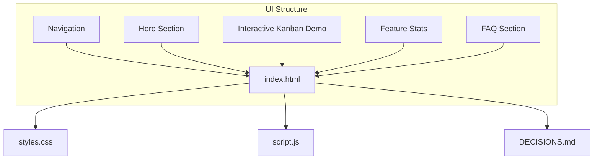

# CareerFlow — Assignment for Acdyon Technologies (Part 2)

A premium home page for **CareerFlow**, a local-first job-hunt workspace. Built as the Acdyon Technologies frontend challenge, Part 2.

## What's inside

- Hero with a clear value prop and one strong CTA
- A working product mock (the pipeline dashboard) — click **"+ Capture a job"** to see the demo interaction
- Honest copy throughout: no fabricated testimonials, user counts, or logos
- Real dark mode (all-or-nothing, tokenized, remembers your choice)
- One earned motion per section: scroll reveal, an animated stat band, the capture interaction
- Works at 390px and 1440px, no horizontal scroll
- **Easter egg:** the Konami code

## Structural Diagram



## Stack

Plain HTML + CSS + JS. No frameworks, no build step, no dependencies — it's a document, not an app.

## Run locally

Open `index.html` directly, or serve it:

```sh
npx serve .
```

## Deploy (Vercel)

This project is optimized for deployment on Vercel. 

1. Push this repository to your GitHub account.
2. Go to your [Vercel Dashboard](https://vercel.com/dashboard) and click **Add New** -> **Project**.
3. Import this GitHub repository.
4. Leave the Framework Preset as `Other` (Static HTML) and click **Deploy**.

## Files

| File | Purpose |
| --- | --- |
| `index.html` | Single-page markup (hero, product, steps, stats, FAQ, CTA, footer) |
| `styles.css` | Design tokens for light/dark, responsive layout, motion |
| `script.js` | Theme, reveal, counters, demo interaction, Konami easter egg |
| `DECISIONS.md` | The 1-page written explanation the assignment asks for |
